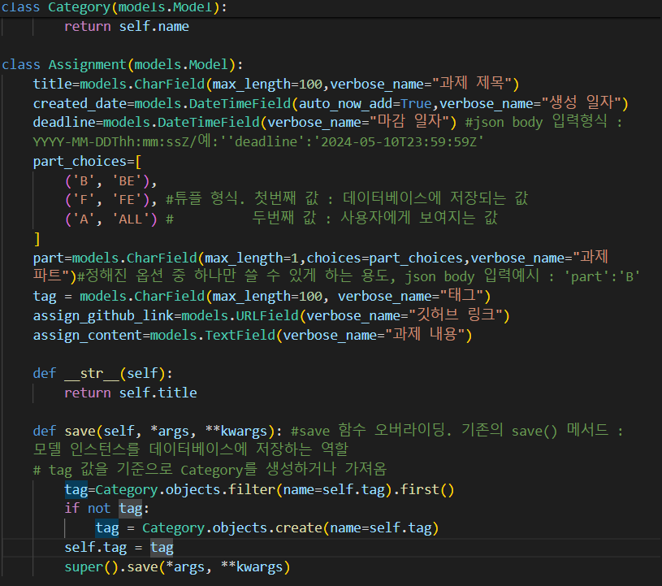
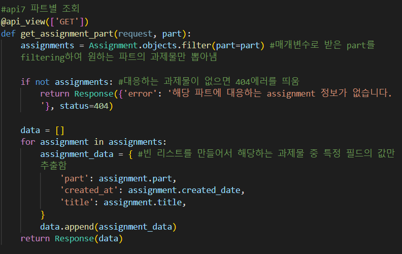
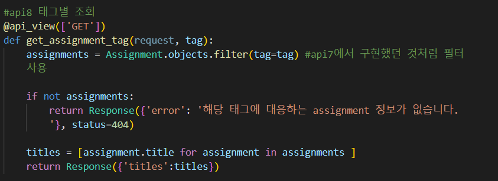

# drf-advanced-team3
drf실습 3팀 과제 레포입니다.
# drf-advanced-team3
drf실습 3팀 과제 레포입니다.
---

### ERD 

### API 명세서 입니다.

### 1. 과제 생성합니다. 

### 2. 특정 과제에 대한 제출물을 생성합니다.

### 3. 생성된 전체 과제를 조회합니다.

### 4. 특정 과제의 내용을 조회합니다.

### 5. 특정 과제의 내용을 수정합니다.

### 6. 특정 과제를 삭제합니다.

### 7. 과제를 파트별로 조회합니다.

### 8. 과제를 카테고리별로 조회합니다.

### 코드 구현 설명

### models.py - Category, Assignment, Submission

### views.py

### api 7 

### api 8 
